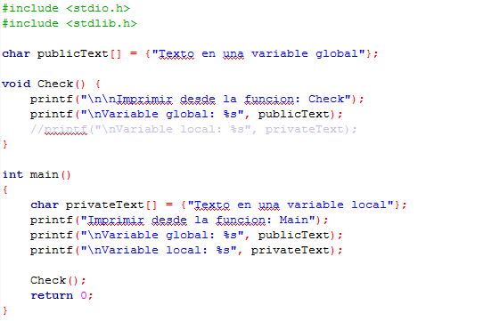

### Clase 21 *Variables locales y globales*

Las reglas de ámbito de un lenguaje son las reglas que controlan si un fragmento de código conoce o tiene acceso a otro fragmento de código o de datos.

**Variable Local**

Es aquella cuyo ámbito se restringe a la función que la ha declarado se dice entonces que la variable es local a esa función. Esto implica que esa variable sólo va a poder ser manipulada en dicha sección, y no se podrá hacer referencia fuera de dicha sección. Cualquier variable que se defina dentro de las llaves del cuerpo de una función se interpreta como una variable local a esa función.

**Variable Global**

Es aquella que se define fuera del cuerpo de cualquier función, normalmente al principio del programa, después de la definición de los archivos de biblioteca (#include), de la definición de constantes simbólicas y antes de cualquier función. El ámbito de una variable global son todas las funciones que componen el programa, cualquier función puede acceder a dichas variables para leer y escribir en ellas. Es decir, se puede hacer referencia a su dirección de memoria en cualquier parte del programa.

El uso de variables globales no es aconsejable a pesar de que aparentemente nos parezca muy útil, esto se debe a varias razones fundamentales:

- Legibilidad menor
- Nos condiciona en muchos casos que el programa sólo sirva para un conjunto de casos determinados.
- El uso indiscriminado de variables globales produce efectos colaterales. Esto sucede cuando existe una alteración no deseada del contenido de una variable global dentro de una función, bien por invocación, bien por olvidar definir en la función una variable local o un parámetro formal con ese nombre. La corrección de dichos errores puede ser muy ardua.
- Atenta contra uno de los principios de la programación, la modularidad. El bajo acoplamiento supone no compartir espacios de memoria con otras funciones, y potenciar el paso de información (llamadas) para que la función trate la información localmente.

Las variables declaradas dentro de una función son automáticas por defecto, es decir, sólo existen mientras se ejecuta la función. Cuando se invoca la función se crean estas variables en la pila y se destruyen cuando la función termina. La única excepción la constituyen las variables locales declaradas como estáticas (static). En este caso, la variable mantiene su valor entre cada dos llamadas a la función aun cuando su visibilidad sigue siendo local a la función.

Una función siempre es conocida por todo el programa, excepto cuando se declara como estática, en cuyo caso sólo la podrán utilizar las funciones del mismo módulo de compilación. 

En C, todas las funciones están al mismo nivel de ámbito. Es decir, no se puede definir una función dentro de otra función. Esto es por lo que C no es técnicamente un lenguaje estructurado en bloques.

También puede suceder que en un mismo ámbito aparezcan variables  locales y globales con el mismo nombre. Cuando sucede esta situación, siempre son las variables locales y argumentos formales los que tienen prioridad sobre las globales.

Un ejemplo de variables locales y globales puede ser vista en nuestro siguiente ejemplo:

Nosotros declaramos al principio del programa una variable global llamada publicText mientras que en nuestra función principal main declaramos otra variable local llamada privateText, además de crear una función void que simplemente imprimirá nuestras variables al ser llamada al igual que en nuestro main.

Al hacer correr nuestro programa podemos observar que al principio nos imprime las variables locales y globales de la función main perfectamente, sin embargo, al llamar a la función Check nos marcara un error ya que la variable privateText se encuentra declarada únicamente en la función main. Pero, si nosotros comentamos a la variable local en la función Check, nuestro programa correra perfectamente imprimiendo las dos variables en la función main y únicamente la variable global en la función Check.

***NOTA: Aprendimos otra forma de declarar un arreglo de cadenas con un texto predeterminado. Además de imprimirlo en pantalla con %s.***

**RETO**

- Utilizando variables globales, ingresa el nombre de un alumno y su calificación
- En una función evalúa si el alumno ha aprobado o no
- La calificación mínima aprobatoria es 7
- Imprimir desde la función si el alumno aprobó