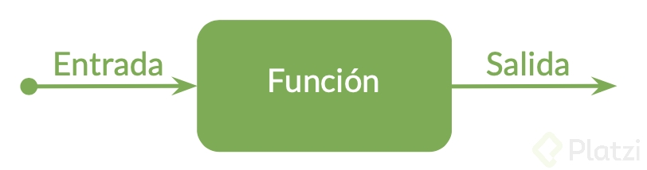
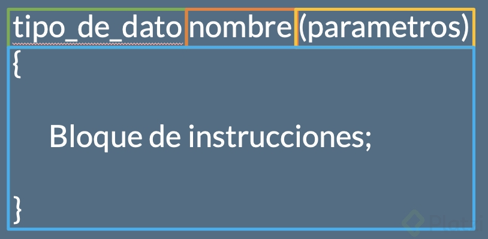

### Clase 22 *Recapitulación: Funciones*

En esta lectura vamos a hablar un poco sobre funciones y cómo utilizarlas.

Las funciones son bloques de código que realizan alguna operación o instrucciones. Estas al igual que en matemáticas pueden aceptar datos de entrada, a estos les llamamos parámetros o argumentos y datos de salida. La función ya creada que hemos estado utilizado hasta ahorita, es la función main(). La estructura sería similar a lo siguiente:

¿Con qué finalidad hacemos estas secciones de código?

- Encapsulamiento
- Reusabilidad
- Separar Tareas
- Cambios a futuro

La sintaxis para escribir una función es la siguiente:

Primero se escribe el tipo de dato de la salida de datos, luego el nombre por el que se identificará la función y finalmente entre paréntesis los parámetros o entrada de datos.

Y entre paréntesis el bloque de instrucciones. No es necesario que una función tenga una entrada y salida de datos, puede tener una, otra, ambas o ninguna.

Pero si tiene salida de datos, el dato final necesita ser descrito con el comando return y el dato que vamos a regresar, que tiene que ser el mismo tipo de dato el cual indicamos inicialmente al crear la función. De la misma manera para los parámetros necesitamos declarar las variables dentro de los paréntesis que vayamos a necesitar, cada una es separada por una coma.

De no necesitar un dato de salida nuestra función puede ser de tipo void, esto quiere decir que no regresa ningún dato.

**Variables globales y locales**

Naturalmente al tener secciones de código, o sea funciones, creamos una necesidad de tener variables que puedan ser compartidas entre estas. Para esto creamos variables globales.

Hasta ahora las únicas variables que habíamos creado eran variables locales, esto quiere decir que son creadas dentro de una función y solo pueden ser utilizadas en esta función.

Para crear variables que usemos entre diferentes funciones lo hacemos con la misma sintaxis que hasta ahora hemos hecho, pero lo haremos fuera de cualquier función y lo haremos en la primera sección de nuestro código en la parte superior. Al hacerlo aquí nosotros estamos creando variables globales que podemos utilizar en cualquier función y será compartida.

Espero que esta última recapitulación te haya servido para reafirmar los conceptos que aprendimos, ¡nos vemos en la siguiente clase!