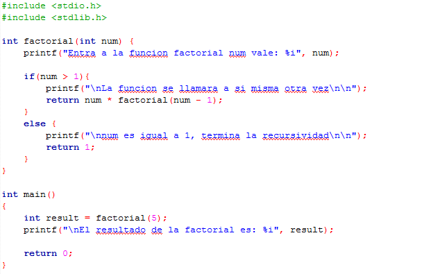

# Clase 23 *Recursividad*

En matemáticas se da el nombre de recursión a la técnica consistente en definir una función en términos de sí misma. Puesto que en C una función puede llamar a otras funciones, se permite que una función también pueda llamarse a sí misma.

Toda función definida recursivamente debe contener al menos una definición explícita para alguno de sus argumentos. De no ser así la función puede caer en un bucle infinito.

**Recursividad**

Se llama recursividad a un proceso mediante el que una función se llama a sí misma de forma repetida, hasta que se satisface alguna determinada condición. El proceso se utiliza para computaciones repetidas en las que cada acción se determina mediante un resultado anterior. Se pueden escribir de esta forma muchos problemas iterativos.

Se deben satisfacer dos condiciones para que se pueda resolver un problema recursivamente:

- Primera: El problema se debe escribir en forma recursiva.
- Segunda: La sentencia del problema debe incluir una condición de fin.

A continuación mostramos un ejemplo típico de recursividad, hallar el factorial de un número. En forma de traza con las sucesivas llamadas simuladas con ventanas.

En nuestra función principal main declaramos una variable result que guardara el valor de la función factorial, mientras enviamos como parámetro el valor de 5. Y, además, imprimimos el resultado final.

En nuestra función recursiva factorial recibimos un número entero, imprimimos el aviso de entrada a la factorial y el valor actual del número en ese momento. Tenemos la condición de que si nuestro número es mayor a 1 la función se llama nuevamente, esta vez con un valor menor, sin embargo, si no se cumple la condición la recursividad termina.

***NOTA: Al probar en el compilador de C este ejemplo, es posible que para valores de n que se les introduzcan mayores de 7 (sobrepasando su factorial el valor 32767, que es el Rango tope de los números enteros), nos comience a dar valores de salida incorrectos.***

**¿Cómo funciona?**

Cuando ejecutamos un programa recursivo, las llamadas recursivas no se ejecutan inmediatamente. Lo que se hace es colocarlas en una pila hasta que la condición de término se encuentra. Entonces se ejecutan las llamadas a la función en orden inverso a como se generaron, como si se fueran sacando de la pila, por tanto el orden sería algo así:

1. !n = n * !(n - 1)
2. !(n - 1) = (n - 1) * !(n - 2)
3. !(n - 2) = (n - 2) * !(n - 3)
4. !(n - 3) = (n - 3) * !(n - 4)
5. !(n - 5) = (n - 4) * !(n - 5)

Los valores reales se devolverán en orden inverso, es decir:

1. !1 = 1
2. !2 = 2 * !1 = 2 * 1 = 2
3. !3 = 3 * !2 = 3 * 2 * 1 = 6
4. !4 = 4 * !4 = 4 * 3 * 2 * 1= 24
5. !5 = 5 * !5 = 5 * 4 * 3 * 2 * 1 = 120

El orden inverso de ejecución es una característica típica de todas las funciones recursivas. Si una función recursiva tiene variables locales, se creará un conjunto diferente de variables locales durante cada nueva llamada. Los nombres de las variables locales serán los mismos, como los hallamos declarado en la función. Sin embargo, las variables representarán un conjunto diferente de valores cada vez que se ejecute la función. Cada conjunto de valores se almacenará en la pila, así cuando el proceso recursivo se deshaga (cuando las llamadas a la función se saquen de la pila y sigan su ejecución) podremos disponer de ellas.
 
En cada llamada de recursiva el compilador utiliza una nueva zona de la pila para almacenar las variables. Esto hace que la administración de la pila enlentezca la ejecución de la función y pueda dar problemas por agotamiento de la memoria de la pila. Por tanto, como toda función recursiva se puede calcular de forma iterativa, es aconsejable utilizar este último modo cuando sea fácil de encontrar.