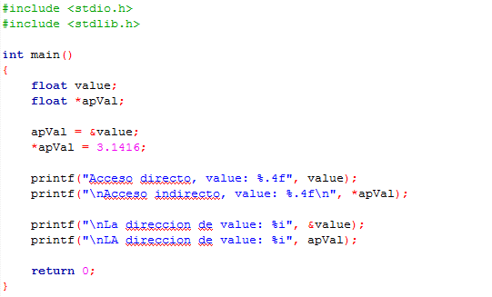

### Clase 24 *Apuntadores*

Un puntero es una variable que contiene la dirección de memoria de una variable dinámica donde se podrá almacenar un valor. Cuando se declara un puntero, de igual manera que con cualquier variable, su contenido es indefinido hasta que se le asigne un valor. Mientras esto no ocurra no se puede decir que exista una variable referenciada, en esta situación se dice que el puntero no está apuntado a una dirección válida. Un apuntador puede inicializarse en NULL que corresponde a una dirección 0 o nula. NULL es una constante simbólica definida en el archivo de cabeceras stddef.h el cual a su vez es incluido en el archivo de cabeceras stdio.h. Al inicializar un puntero en NULL se garantiza que el puntero no apunte a una dirección inválida pero con esto tampoco se define una variable referenciada.

**Operadores de punteros**

Básicamente existen dos operadores para manipular los punteros, estos son:

- El operador de dirección (&) regresa la dirección de una variable.
- El operador de indirección (*) toma la dirección de una variable y regresa el dato que contiene esa dirección.

Teniendo en cuenta el siguiente ejemplo:

Contamos con dos variables: una variable flotante llamada 'value' y un apuntador llamado 'apVal'. Podemos ver que para declarar un apuntador es necesario el tipo de dato y poner un asterisco (*) antes del nombre que tendrá nuestro apuntador.

Con el ampersand (&) hacemos que nuestro puntero apVal apunte a la variable value. Y con el asterisco (*) hacemos que ahora la variable value tenga el valor de 3.1416.

Nosotros podemos imprimir tanto directa como indirectamente el valor de nuestra variable: directamente seria la forma normal en donde ponemos el nombre de la variable y la forma indirecta sería mediante el apuntador escribiendo *_nombreApuntador. También podemos imprimir la dirección en donde se encuentra nuestra variable al escribir &_nombreVariable o simplemente el nombre del puntero.