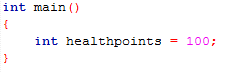
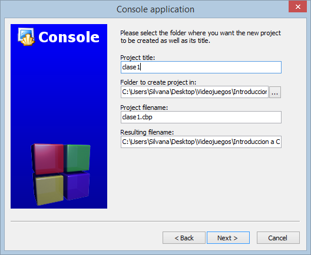

# Clase 3 _Variables y tipos de datos (Asignación y clasificación)_

**Diseño de programas de software**

Los programas tienen una secuencia de secuencia de actividades (fases) que deben
ser seguida para generar un conjunto coherente de productos.

Estas fases son:

- Análisis
- Diseño
- Programación
- Codificación
- Prueba
- Mantenimiento
- Documentación

En la fase de Análisis y Diseño nos concentramos en el concepto y diseño del
programa, software, aplicación o juego estamos creando.

Las siguientes fases, Programación y Codificación, es la parte que creamos el
código para el software en el que estemos trabajando. La fase de Prueba es una
fase muy importante porque tenemos que probar que nuestro software funciona
correctamente, es cuando compilamos el código, la programación, y vemos que
funciona bien. También hacemos cambios si es necesario.

La fase de Mantenimiento cambia mucho dependiendo del tipo de programa que
nosotros tengamos. Por ejemplo, en los juegos en línea pasan mucho tiempo en
mantenimiento porque están constantemente expuestos a los usuarios, o los
programas que tengan poco mantenimiento, programas pasan mucho tiempo en
desarrollo y al momento son sacadas al público no tengan mantenimiento más allá
de unos pequeños bugs.

Finalmente esta la fase de Documentación, es importante porque si estamos
trabajando con otras personas necesitamos documentar nuestro trabajo para que
ellos también puedan entender correctamente lo que estamos haciendo.

**¿Qué es un tipo de dato?**

Es una clasificación que el programador le da a la información almacenada para
avisarle al compilador como va a ser interpretada.

Un tipo de dato es, en esencia, un espacio en memoria con restricciones.

**Tipos de datos primitivos**

- **Numérico:** Este tipo de datos se divide en enteros y reales.

  - **int:** Son los números enteros, es decir, aquellos que no tienen
    fracciones o decimales. Pueden ser negativos o positivos y el rango puede
    variar de un compilador a otro. Se almacenan internamente en 2 o 4 bytes de
    memoria y pueden ser: unsigned int, short int, int, unsigned long o long
    (cada uno de estos datos puede almacenar un rango diferente de valores).
    Cuando el rango de los tipos básicos no es suficientemente grande para sus
    necesidades, se consideran tipos enteros largos. Ambos tipos long requieren
    4 bytes de memoria (32 bits) de almacenamiento.

    Algunos ejemplos de números enteros pueden ser: 3, 27, -18, 0

  - **float / double:** Son los números reales o de coma flotante. Los tipos de
    datos flotantes contienen una coma (un punto) decimal, pueden ser positivos
    y negativos formando el subconjunto de los números reales. Para representar
    números muy pequeños o muy grandes se emplea la notación de punto flotante,
    que es una generalización de la notación científica. El lenguaje C soporta
    tres formatos de coma flotante; el tipo float requiere 4 bytes de memoria,
    double 8 bytes, y long double 10 bytes.

    Algunos ejemplos de números flotantes o dobles pueden ser: 3.14, -0.01, 1.8,
    0.27

- **Caracteres:** El almacenamiento de caracteres en el interior de la
  computadora se hace en “palabras” de 8 bits (1 byte). Este tipo representa
  valores enteros en el rango 2128 a 1127. El lenguaje C proporciona el tipo
  unsigned char para representar valores de 0 a 255 y así representar todos los
  caracteres ASCII.

  Una característica de la parte estándar del conjunto de caracteres (los 128
  primeros) es que contiene las letras mayúsculas, las minúsculas y los dígitos,
  y que cada uno de estos tres subconjuntos está ordenado en su forma natural,
  por lo que podemos manejar rangos de caracteres bien definidos. Los
  caracteres se almacenan internamente como números y por lo tanto se pueden
  realizar operaciones aritméticas con datos tipo char. Existe también el dato
  tipo cadena (compuesto), que es una sucesión de caracteres que se
  encuentran delimitados por comillas; la longitud de una cadena es el número de
  caracteres comprendidos entre los delimitadores "[long_cad]".

  - **char:** Una variable tipo char se representa como un solo carácter
    encerrado entre comillas simples.

    Algunos ejemplos son: 'P', 'L', 'A', 'T', 'Z', 'I'

- **Booleanos:** Hay lenguajes que sólo pueden tomar uno de dos valores:
  verdadero (true) o falso ( false ). En lenguaje C no existe el tipo lógico
  pero se puede implementar con un número entero, 0 es falso y cualquier número
  diferente de cero es verdadero. Algunos compiladores utilizan el bool.

  - **bool:** Tipo de dato que representa algo que puede ser verdadero o falso.

**¿Qué es una variable?**

Es un espacio reservado en memoria, definido por un tipo de dato y un nombre
asignado, en el cual se puede guardar un valor y se puede modificar.

**Declaración y asignación de una variable en C**

Para declarar una variable es necesario poner el tipo de dato que deseamos,
seguido de su nombre. En este ejemplo, nuestro tipo de dato es un entero (int)
de nombre healthpoints.

Para asignarle un valor es necesario el nombre de la variable (healthpoints)
seguido del operador de asignación (=) y el valor que le daremos (100)

**_NOTA: No debemos confundir el operador de asignación (=) con el de
comparación (==)._**

**Inicialización de una variable**

Para inicializar una variable ponemos primero el tipo de dato (int), el nombre
(healthpoints) y el valor que deseamos (100).

**Diferencias entre inicializar y declarar**

Cuando declaramos una variable no le asignamos un valor inicial, en cambio
cuando inicializamos una variables nosotros la estamos declarando y dándole un
valor inicial.

**Usar codeblocks**

Para crear nuestro primer proyecto en codeblocks hacemos lo siguiente. Vamos en
la pestaña de 'File', luego a 'New' y finalmente 'Project':

Se nos abrirá una nueva ventana en la que elegiremos 'Console application' y
damos click en 'Go':

Damos click en 'Next':

Elegimos C y después damos click en 'Next':

Le ponemos un nombre a nuestro proyecto, en 'Folder to create project in'
podemos elegir donde deseamos guardar nuestro proyecto, y finalmente damos click
en 'Next':

Y finalmente damos click en 'Finish':

Ahora ya podemos trabajar en codeblocks, creando lo que deseemos en lenguaje C
(o C++ si es lo que elegiste):

