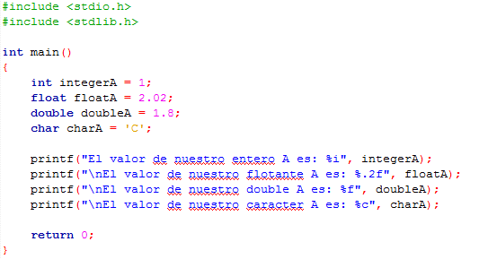

# Clase 4 _Entrada y salida de datos_

Aprenderemos como podemos tener información que entra y sale de nuestro
programa, es decir, cuando nosotros usamos un input es una entrada que el
usuario tiene con el programa y la información que visualizamos es la salida de
los datos obtenidos. Por ejemplo, podemos obtener información mediante los
teclados y posteriormente verlos en pantalla.

**¿Cómo imprimimos el valor de una variable?**

- #include<librería> usada para “incluir” las declaraciones de otro fichero en
  la compilación.
- stdio.h es el fichero que proporciona el núcleo de las capacidades de
  entrada/salida del lenguaje C (incluye la venerable función printf).
- stdlib.h es el fichero usado para realizar ciertas operaciones como conversión
  de tipos, generación de números pseudo-aleatorios, gestión de memoria
  dinámica, control de procesos, funciones de entorno, de señalización (??), de
  ordenación y búsqueda.
- main() sirve como punto de partida para la ejecución del
  programa. Normalmente, controla la ejecución del programa dirigiendo las
  llamadas a otras funciones del programa.
- Dentro de la función principal inicializamos un entero (int) de nombre
  integerA con el valor de 18, posteriormente usamos la función printf para
  imprimirlo en pantalla.
- La función printf (que deriva su nombre de “print formatted”) imprime un
  mensaje por pantalla utilizando una “cadena de formato” que incluye las
  instrucciones para mezclar múltiples cadenas en la cadena final a mostrar por
  pantalla.

**Formateadores**

Printf permite dar formato específicos a la salida de información.

Printf es una función especial porque recibe un número variable de parámetros.
El primer parámetro es fijo y es la cadena de formato. En ella se incluye texto
a imprimir literalmente y marcas a reemplazar por texto que se obtiene de los
parámetros adicionales. Por tanto, printf se llama con tantos parámetros como
marcas haya en la cadena de formato más uno (la propia cadena de formato). El
símbolo "%" denota el comienzo de la marca de formato. Y al final, después de la
coma, se pone el nombre de la variable a imprimir.

En el ejemplo vemos que:

- %i imprime números enteros (int).
- %.2f imprime números coma flotante decimal de precisión simple (float) con un
  largo de 2 dígitos, justificados a la derecha.
- %f imprime números coma flotante decimal de precisión simple (float).
- %c imprime un carácter con el código ASCII.

**Imprimir todo en una línea**

Como sabemos, printf acepta tanto parámetros como marcas haya en la cadena de
formato, es decir, podemos imprimir todo el ejemplo anterior en una línea
completa.

En el lenguaje C existen caracteres que no son imprimibles o visibles en la
consola. También se les llama caracteres de escape, ya que siempre llevan una
barra invertida "\" seguido del carácter. En el ejemplo vemos el uso de "\n" que
nos proporciona un salto de línea.

**Entrada de datos**

Mediante la función scanf podemos introducir cualquier combinación de valores
numéricos, caracteres sueltos y cadenas de caracteres a través del teclado. En
definitiva, scanf lee datos formateados de la entrada estándar. Cuando hablamos
de datos formateados, nos referimos a que los datos se pueden presentar en
distintos formatos. La función devolverá el número de datos que se han
introducido correctamente.

En el ejemplo usamos la función printf para imprimir un mensaje al usuario y
posteriormente la función scanf para que ese usuario pueda ingresar el valor que
desea.

**RETO**

- Crear dos variables
- Ingresar y guardar el valor de ambas variables
- Intercambiar el valor de las variables con ayuda de una variable auxiliar
- Imprimir el valor de las variables ya intercambiadas
