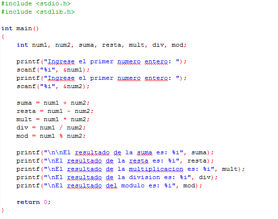

# Clase 5 _Operadores aritméticos_

Se llaman operadores aritméticos a aquellos que permiten realizar cálculos con valores numéricos para obtener un resultado. Los operadores aritméticos más habituales son la suma, resta, multiplicación y división. En C y en otros lenguajes disponemos de un operador adicional al que denominamos operador módulo (%), que nos permite obtener el resto de una división entre enteros.

La mayoría de estos operadores nos resultan conocidos, pues ya los hemos estudiado con el pseudocódigo. Las reglas de prioridad son las mismas que explicamos al hablar de pseudocódigo. Los paréntesis definen la prioridad principal. El siguiente orden de prioridad corresponde a las operaciones de multiplicación y división. Las operaciones de suma y resta tienen menor precedencia. Y en último lugar tendríamos la operación para obtener el módulo de una división entera.

C no reconoce el operador ^ para el cálculo de potencias de un número, ni el operador div o barra invertida para la obtención del cociente o división entera de una división. Existen otras alternativas que permiten realizar estas operaciones.

Existen otros operadores admitidos que constituyen formas de expresar abreviadamente una operación. Por ejemplo += se puede usar para indicar que la variable a la izquierda toma el valor resultante de sumarse a sí misma con la variable o expresión a la derecha. Si A=4 y se ejecuta A +=3; entonces A pasa a tomar el valor 7, equivalente a realizar la operación A = A + 3.

Los operadores aritméticos básicos en C son:

- Suma: +
- Resta: -
- Multiplicación: \*
- División: /
- Módulo: %

En nuestro ejemplo pedimos que el usuario ingrese dos números enteros, después realizamos las operaciones aritméticas y finalmente imprimimos el resultado:

**PRIMER RETO**

- Ingresa los valores necesarios para calcular el área de un cilindro (radio y altura)
- Realiza la operación
- Imprime el resultado del área y el volumen

**SEGUNDO RETO**

- Ingresa la temperatura en grados Fahrenheit
- Realiza la operación para convertir de grados Fahrenheit a Celsius
- Imprimir el resultado de la conversión
