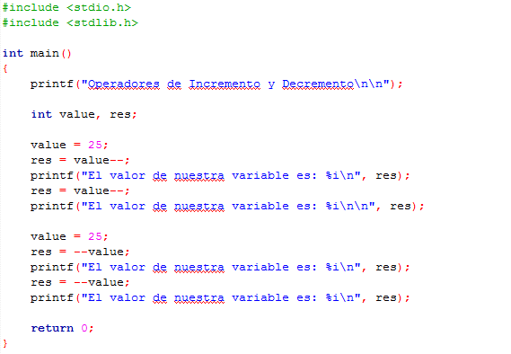

# Clase 6 _Operadores de asignación, de incremento y decremento_

Un operador de asignación altera el valor de un objeto sin alterar su tipo. El operador usual de asignación (=), copia el valor del operando de la derecha en el operando de la izquierda, aplicando las conversiones de tipo usuales cuando es necesario.

Tenemos el siguiente ejemplo:

Declaramos una variable entera de nombre value y le asignamos (=) el valor 11.

1. Le asignamos la suma (+=) de 1, es decir, le sumamos 1 (value + 1 o 11 + 1)
2. Le asignamos la resta (-=) de 2, es decir, le restamos 2 (value - 2 o 12 - 2)
3. Le asignamos el producto (_=) de 5, es decir, lo multiplicamos por 5 (value _ 5 o 10 \* 5)
4. Le asignamos la división (/=) de 4, es decir, dividimos por 4 (value / 4 o 50 / 4)
5. Le asignamos el módulo (%=) de 4, es decir, tenemos el resto de la división por 4 (value % 4 o 50 % 4)

Los operadores unitarios ++ (incremento) y -- (decremento), suman y restan respectivamente una unidad al valor de la expresión. Existen dos variedades "Pre" y "Post" para cada uno de ellos.

**Pre y Post incremento**

En este ejemplo podemos ver la diferencia entre el pre y el post incremento.

Mientras que el post incremento, value++, añade uno a la expresión después de que se ha evaluado, es decir, primero nos imprime el valor inicial (25) y después el incremento (26).

El pre incremento, ++value, añade uno antes de que sea evaluada la expresión, es decir, ya nos imprime el valor incrementado (26) y si lo volvemos a realizar nos imprime nuevamente el nuevo valor incrementado en más uno (27).

**Pre y post decremento**

Similar al ejemplo anterior, podemos notar las diferencias entre el pre y el post decremento.

En el post decremento, value--, resta uno a la expresión después de que se ha evaluado, es decir, primero nos imprime el valor inicial (25) y después el decremento (24).

El pre decremento, --value, resta uno antes de que sea evaluada la expresión, es decir, ya nos imprime el valor decrementado (24) y si lo volvemos a realizar nos imprime nuevamente el nuevo valor decrementado en menos uno (23).

**PRIMER RETO**

- Crear una variable llamada x con valor de 10
- Utilizando operadores de asignación, que esta variable se sume a sí misma el doble de su valor.
- Imprime el resultado

**SEGUNDO RETO**

- Ingrese un valor entero
- Usando operadores de asignación realiza la operación de modulo del valor ingresado con 5
- Imprime el resultado más uno usando operadores de incremento
