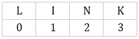
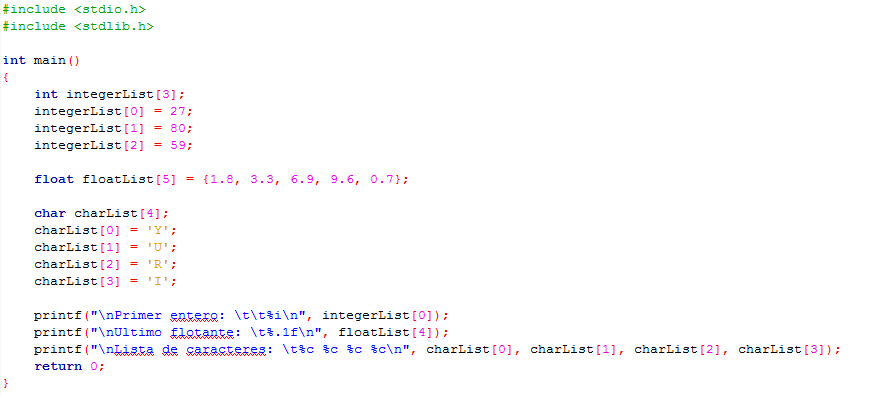

# Clase 14 _Arreglos unidimensionales_

Un arreglo o array es básicamente una estructura de datos almacenada como una sola variable. Hasta el momento habíamos visto variables y constantes, pero en este caso es una estructura algo más compleja, ya que se compone de varios elementos de un mismo tipo. Por ejemplo, podía ser una lista finita de números o de palabras que se almacenarían en celdas contiguas de memoria.

Cada uno de esos elementos se distinguen por un índice o subíndice al que se puede apuntar con un puntero para acceder a dicha posición del array. Además, también se podría escribir código para acceder de forma aleatoria a estos elementos de los que se compone el arreglo.

**Arreglo unidimensional**

Un array de tipo unidimensional es básicamente un vector de datos o lista. Dicho de otro modo, es un conjunto de variables del mismo tipo y tamaño que ocupan posiciones consecutivas en una memoria. El tamaño de la memoria ocupada por el array es siempre fijo y no se puede variar.

Debemos tener en cuenta que la posición de los arreglos siempre empiezan en cero y terminan en n-1, es decir, imaginemos que tenemos el siguiente arreglo de caracteres:

'L I N K' es un arreglo de tamaño cuatro (que acepta cuatro caracteres), pero vemos que la posición empieza en cero y va hasta el tres.

En nuestro siguiente ejemplo:

Tenemos tres variables de diferentes tipos. La primera variable es tipo entero llamado integerList de tamaño tres, el segundo es una variable de tipo flotante llamada floatList de tamaño cinco y el tercero es una variable de tipo carácter llamada charList de tamaño cuatro.

Asignamos los valores en las variables: integerList y charList son declaradas, y posteriormente ingresamos manualmente los valores. Mientras que floatList es inicializada.

Vemos que el número dentro de los corchetes [] son el tamaño que tendrá el arreglo, mientras que, si inicializamos con valores, podemos los valores dentro de llaves {} y separados por coma.

Finalmente imprimimos diferentes valores: Con integerList imprimimos el primer valor del arreglo, con floatList imprimimos el último valor del arreglo y charList imprime la totalidad de los valores que contiene el arreglo.

**NOTA:**

Aparece un nuevo carácter no imprimible "\t" que nos da una tabulación de cuatro líneas.

**RETO**

- Ingresar valores a un arreglo con un tamaño de 5
- Multiplicar todos sus valores
- Imprimir sus resultados
