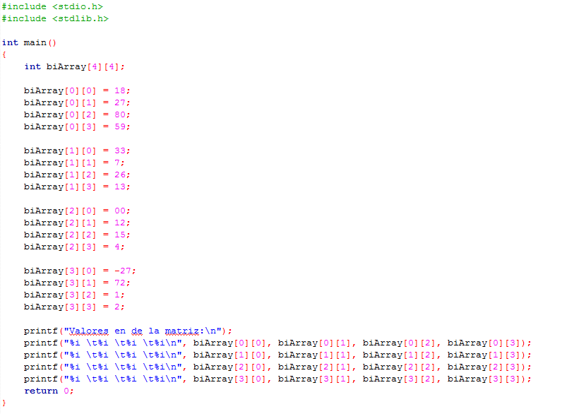

# Clase 15 _Arreglos bidimensionales_

Los arreglos bidimensionales son también llamados tablas o matrices tienen
varias filas y columnas. Tiene dos índices: el primero indica el número
de fila y el segundo el número de columna en que se encuentra el elemento.

Un arreglo bidimensional es interpretado como un arreglo unidimensional con n
número de filas (f), donde cada componente es un arreglo unidimensional de n
número de columnas (c). Un arreglo de dos dimensiones contiene, pues, n número
de f x c (números de filas x números de columnas) componentes.

Por ejemplo, digamos que tenemos un arreglo de 3 x 4 en donde:

Siendo un arreglo bidimensional o matriz de 3 x 4 significa que 3 filas y 4
columnas (recordemos que las posiciones de los arreglos comienzan en cero).

En el siguiente ejemplo:

Declaramos una matriz de 4 x 4 de tipo entero y luego ingresamos manualmente los
valores, finalmente imprimimos la matriz en pantalla.

Vemos que para declarar una matriz tenemos dos corchetes: el primer corchete
simboliza el número de filas y el segundo corchete el número de columnas que
tendrá nuestra matriz.

**RETO**

Crear un arreglo de 3 filas por 4 columnas en donde:

- Los elementos de la primera fila sumen un total de 4
- Los elementos de la segunda fila sumen un total de 10
- Los elementos de la tercera fila sumen un total de 26
- Imprime las sumatorias de cada fila
