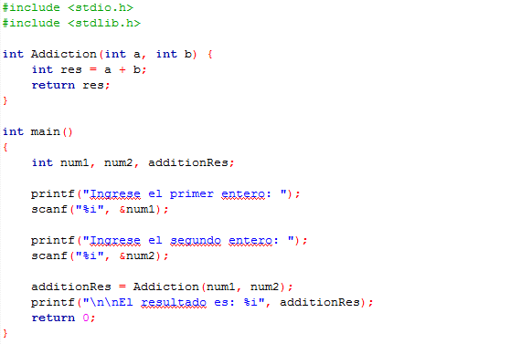

# Clase 20 _Funciones: Divide y vencerás_

La experiencia ha mostrado que la mejor forma de desarrollar y mantener un programa grande es construirlo a partir de piezas menores o módulos, siendo cada uno de ellos más fácil de manipular que el programa original. Esta técnica se conoce como divide y vencerás.

C fue diseñado para hacer funciones eficientes y fáciles de usar. Los programas C consisten generalmente de varias funciones pequeñas en vez de pocas grandes.

**Funciones**

Las funciones es un fragmento de código que realiza una tarea bien definida. Se invocan mediante una llamada de función, la llamada de función específica el nombre de la misma y proporciona información (en forma de argumentos) que la función llamada necesita a fin de llevar acabo su tarea. Por ejemplo, la función printf imprime por la salida estándar los argumentos que le pasamos.

Las funciones permiten a un programador modularizar un programa. Todas las variables declaradas en las definiciones de función son variables locales (son conocidas solo en la función en la cual están definidas).

La mayor parte de las funciones tienen una lista de parámetros. Los parámetros proporcionan la forma de comunicar información entre funciones. Los parámetros de función son también variables locales.

Existen varios intereses que dan motivo a la "funcionalización" de un programa. El enfoque de divide y vencerás hace que el desarrollo del programa sea más manipulable. Otra motivación es la reutilización del software - el uso de funciones existentes como bloques constructivos para crear nuevos programas.

Cada función debería limitarse a ejecutar una tarea sencilla y bien definida y el nombre de la función deberá expresar claramente dicha tarea.

Si no se puede elegir un nombre conciso es probable que la función esté intentando ejecutar demasiadas tareas diversas.

Se pueden utilizar para:

- Encapsulamiento
- Reusabilidad de código
- Separar tareas
- Cambios a futuro

Consideremos el siguiente código como ejemplo:

En donde tenemos dos funciones: la función principal main que hemos usado desde los principios de todo este curso y sirve como punto de partida para la ejecución del programa, y la función Addiction que recibe dos parámetros.

La función main tiene declarado tres variables enteras: dos variables (num1, num2) que reciben datos del usuario desde el teclado y la tercera variable (additionRes) se encarga de llamar a la función Addiction enviando los dos números enteros para posteriormente recibir el resultado de la suma. Al final, se imprime el resultado de la suma.

La función Addiction tiene dos parametros de tipo entero por donde recibe los datos, además declara una variable que guarda la suma y posteriormente utiliza la sentencia return para regresar la variable resultado. Aunque también podemos obviar la variable resultado, retornando directamente la suma escribiendo return a + b;.

**PRIMER RETO**

Vamos a calcular la potencia de un número:

- Ingresar un valor base
- Ingresar un valor de exponente
- Dentro de una función calcular el exponente del número base
- Imprime el resultado

**SEGUNDO RETO**

- Hacer un programa que cambie de dólares a tu moneda y de tu moneda a dólares
- Usa funciones
