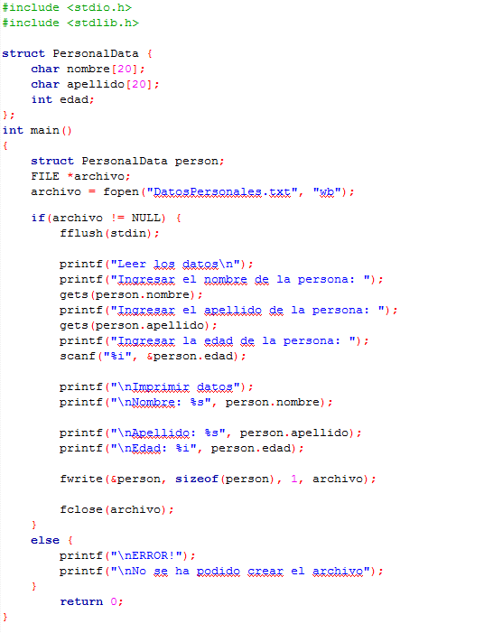

# Clase 26 *Escritura y lectura de archivos*

**Escritura de archivos**

Y creamos un fichero llama DatosPersonales con la combinación wb. Recordemos que la w crea un nuevo archivo y lo abre para la escritura, mientras que la b abre el archivo en modo binario. En su interior escribimos el código para ingresar los datos de la estructura person por teclado y posteriormente imprimirlo que sería lo guardado dentro del archivo.

También tenemos:

- **Comprobación de fichero abierto**

  Un aspecto muy importante después de intentar abrir un fichero es comprobar si realmente está abierto. El sistema no es infalible y pueden producirse fallos: el fichero puede no existir, estar dañado o no tener permisos de lectura. Si intentamos realizar operaciones sobre un puntero tipo FILE cuando no se ha conseguido abrir el fichero puede haber problemas.

  Si el fichero no se ha abierto, el puntero fichero (puntero a FILE) tendrá el valor NULL, si se ha abierto con éxito tendrá un valor distinto de NULL. Si fichero == NULL significa que no se ha podido abrir por alguna causa, lo más conveniente es salir del programa. Para salir utilizamos la función exit(), donde el argumento 1 indica al sistema operativo que se han producido errores. Esta función precisa del archivo de cabecera stdlib.h.

- **Escritura del fichero: fwrite**

  Ésta función nos permite escribir en un fichero. Tiene cuatro parámetros en los cuales: el primero es el puntero a la variable que contiene los datos que vamos a escribir en el fichero, el segundo es el tamaño del tipo de dato a escribir, el tercero es el número de datos a escribir y el cuarto es el puntero al fichero sobre el que trabajaremos.

- **Cierre del fichero: fclose**

  Una vez realizadas todas las operaciones deseadas sobre el fichero hay que cerrarlo. Es importante no olvidar este paso pues el fichero podría corromperse. Al cerrarlo se vacían los buffers y se guarda el fichero en disco. Un fichero se cierra mediante la función fclose.

***NOTA: Para saber el tamaño de nuestro tipo de dato usamos la función sizeof que nos devuelve el tamaño en bytes que ocupa una variable o algún tipo de dato.***

**Lectura de archivos**

Teniendo en cuenta este ejemplo. Para eso cambiamos nuestra combinación a rb en donde: r nos abrirá un archivo para su lectura y b lo abrirá en modo binario. Nosotros también usamos la función fread para extraer la información guardada dentro de nuestro fichero. Similar al fwrite, esta función también recibe cuatro parámetros:

1. Dirección de la variable donde se almacenarán los datos leídos del fichero.
2. Tamaño del tipo de dato a leer.
3. El número de datos a leer.
4. El puntero al fichero sobre el que trabajaremos.